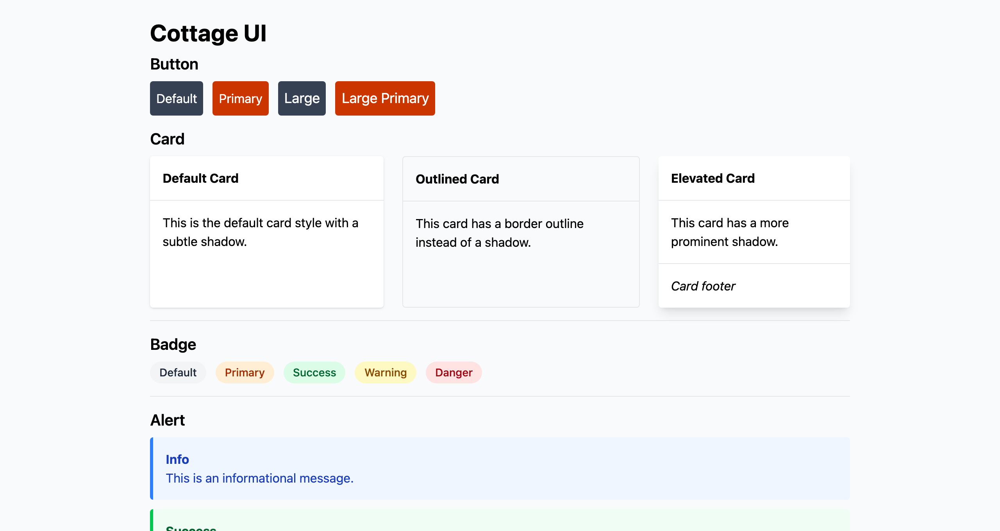

# Cottage UI

A React component library built with TypeScript, TailwindCSS, and Vite. Created as part of the [Build A React UI Library series](https://www.youtube.com/playlist?list=PLcfAVClOb1BiA6oIfHQ6Am3lpWzOmMO6J).

## Demo



## Features

- TypeScript-first component library
- Styled with TailwindCSS
- Tree-shakeable ESM and UMD builds
- Comprehensive test coverage with Vitest
- Interactive documentation with Storybook
- Type declarations bundled

## Installation

```bash
npm install cottage-ui
# or
yarn add cottage-ui
# or
pnpm add cottage-ui
```

## Usage

```tsx
import { Button, BUTTON_VARIANTS, BUTTON_SIZES } from 'cottage-ui'
import 'cottage-ui/dist/style.css'

function App() {
  return (
    <Button
      variant={BUTTON_VARIANTS.PRIMARY}
      size={BUTTON_SIZES.LARGE}
      onClick={() => console.log('Clicked!')}
    >
      Click me
    </Button>
  )
}
```

## Development

This project uses **pnpm** as the package manager. Do not use npm or yarn.

### Setup

```bash
# Install dependencies
pnpm install

# Start development server (demo app)
pnpm run dev

# Start Storybook
pnpm run storybook
```

### Available Commands

```bash
# Development
pnpm run dev              # Start Vite dev server with demo app
pnpm run storybook        # Start Storybook on port 6006

# Building
pnpm run build            # Build library for production
pnpm run build-storybook  # Build static Storybook

# Testing
pnpm test                 # Run tests in watch mode
pnpm run coverage         # Run tests with coverage report

# Quality
pnpm run lint             # Lint TypeScript files with ESLint
```

### Project Structure

```
cottage-ui/
├── lib/                  # Library source code (published)
│   ├── main.ts          # Main entry point
│   ├── tailwind.css     # TailwindCSS imports
│   ├── test/            # Test setup
│   └── ComponentName/   # Component directories
│       ├── ComponentName.tsx
│       ├── ComponentName.test.tsx
│       └── ComponentName.stories.tsx
├── src/                 # Development app (not published)
├── dist/                # Build output
└── .storybook/          # Storybook configuration
```

**Important**: The `lib/` directory contains the library source code that gets published. The `src/` directory is only for local development and testing.

### Creating a New Component

1. Create a new directory in `lib/ComponentName/`
2. Create three files:
   - `ComponentName.tsx` - Component implementation
   - `ComponentName.test.tsx` - Vitest tests
   - `ComponentName.stories.tsx` - Storybook stories
3. Export the component from `lib/main.ts`

See `lib/Button/` for a reference implementation.

For detailed patterns and guidelines, see [Component Documentation](lib/Button/Button.md).

## Testing

Tests are written with Vitest and React Testing Library. Test files are co-located with components.

```bash
# Run all tests in watch mode
pnpm test

# Run tests with coverage
pnpm run coverage
```

See [Testing Documentation](lib/test/README.md) for testing patterns and utilities.

## Architecture

This library follows a component-per-directory structure with co-located tests and stories. Components use TypeScript enums for variants and Record types for style mappings.

## Contributing

1. Make changes in the `lib/` directory
2. Add tests for new functionality
3. Add Storybook stories for new components
4. Run tests: `pnpm test`
5. Run linter: `pnpm run lint`
6. Build: `pnpm run build`

## Documentation

- [CLAUDE.md](CLAUDE.md) - AI agent guidance for this codebase
- [lib/README.md](lib/README.md) - Library structure documentation
- [lib/test/README.md](lib/test/README.md) - Testing patterns and utilities

## Changelog

- **0.1.1** - Add Vitest testing
- **0.0.3** - Add TailwindCSS and Storybook
- **0.0.2** - Initial component structure
- **0.0.1** - Project initialization

## License

See package.json for license information.

## Resources

- [YouTube Series](https://www.youtube.com/playlist?list=PLcfAVClOb1BiA6oIfHQ6Am3lpWzOmMO6J)
- [Storybook Documentation](https://storybook.js.org/)
- [Vitest Documentation](https://vitest.dev/)
- [TailwindCSS Documentation](https://tailwindcss.com/)
